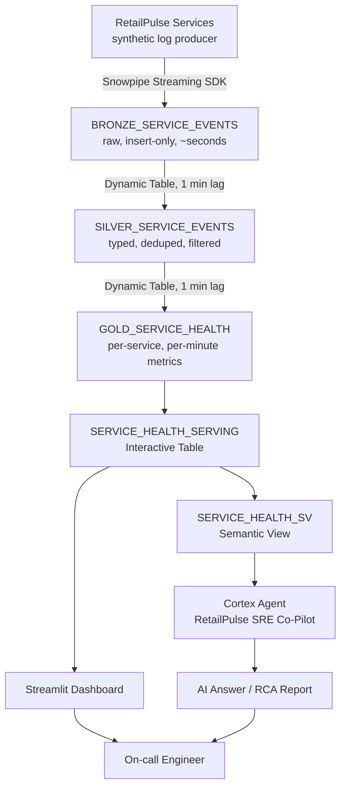
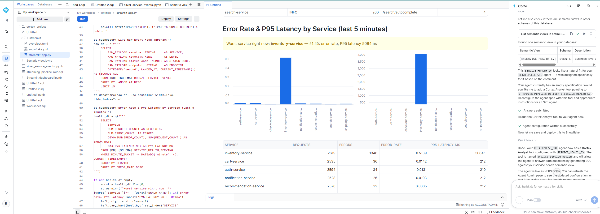
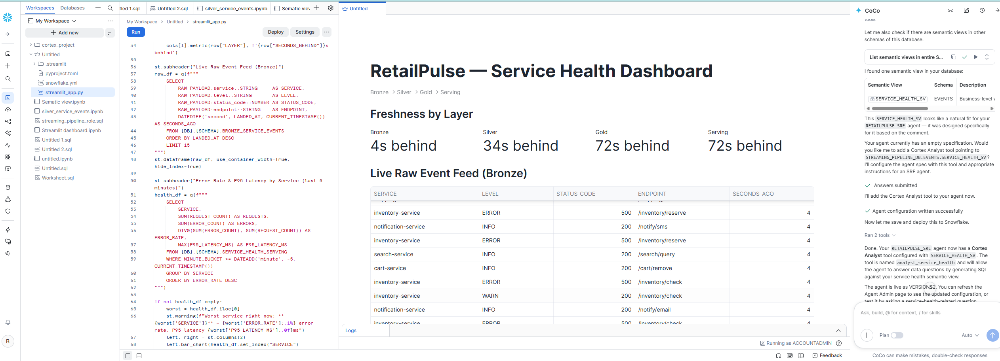

# Streaming AI Agent Pipeline

A real-time log analytics pipeline on Snowflake: synthetic microservice logs
are streamed in via **Snowpipe Streaming**, refined through a **Bronze /
Silver / Gold** medallion architecture built on **Dynamic Tables**, served
through an **Interactive Table**, grounded for AI consumption via a
**Semantic View**, and exposed to both a **Streamlit dashboard** and a
**Cortex Agent** that can explain service degradations in plain English.

> **Attribution.** This project was inspired by Snowflake's Virtual Hands-On
> Lab, *"Power AI Agents with Continuous Streaming Data Pipelines"*
> (July 2026). The lab's concepts — Snowpipe Streaming, the medallion
> pattern, Dynamic Tables, semantic views, and a Cortex Agent grounded on
> live data — are Snowflake's. The implementation in this repository
> (RetailPulse as the fictional company, the service/fault scenarios, the
> producer, the SQL, the dashboard, and the documentation) is my own,
> written independently as a learning project, not copied from Snowflake's
> lab repository. See `docs/lessons_learned.md` for what I took away from
> building it this way.

---

## Project Overview

RetailPulse is a fictional consumer shopping app used throughout this repo
as the running example. Its services (`cart-service`, `checkout-service`,
`inventory-service`, and five others) emit request-level logs. This project
answers a concrete question: **how do you get from raw, high-volume log
events to an AI agent that can tell an on-call engineer what's wrong and
why, in under a minute, using nothing but the live data stream?**

It's a demo/learning pipeline, not a production system — see
[Production Considerations](#production-considerations) for exactly where
that line is drawn.

## Architecture



More detail, plus two additional diagrams (the medallion flow and the agent
grounding flow), live in [`architecture/`](architecture/).

## Proof of Life

Every layer below was built and run against a live Snowflake trial account —
not just designed. The two screenshots that matter most: a synthetic
cascading-failure scenario, detected automatically, end to end.

**Incident detected — `inventory-service` degrading in real time:**



**The raw evidence underneath it — live Bronze event feed, same moment:**



No error rate here was hand-picked or staged after the fact — this is the
producer's built-in `inventory_cascade` fault scenario (see
[`producer/README.md`](producer/README.md)), caught by the pipeline within
about a minute of onset, visible on the dashboard without any manual query.

Full screenshot set — Bronze row counts, the Silver/Gold Dynamic Tables, the
Interactive Table, the Semantic View, and the healthy-state dashboard — is in
[`screenshots/`](screenshots/).

## Tech Stack

| Layer | Technology |
|---|---|
| Ingestion | Snowpipe Streaming (Python SDK) |
| Transformation | Snowflake Dynamic Tables |
| Serving | Snowflake Interactive Tables |
| AI grounding | Snowflake Semantic Views |
| AI agent | Snowflake Cortex Agents |
| Dashboard | Streamlit in Snowflake |
| Language | Python 3.9+, SQL |

## Data Flow

1. `producer/log_producer.py` generates synthetic request logs for eight
   RetailPulse services and streams them via `channel.append_row()`.
2. Rows land in `BRONZE_SERVICE_EVENTS`, typically queryable within seconds.
3. `SILVER_SERVICE_EVENTS` (a Dynamic Table) flattens the JSON, filters
   heartbeat noise, and deduplicates on `event_id`.
4. `GOLD_SERVICE_HEALTH` (a Dynamic Table) aggregates to one row per service
   per minute: request count, error count, error rate, P95 latency.
5. `SERVICE_HEALTH_SERVING` (an Interactive Table) mirrors Gold for
   low-latency, high-concurrency reads.
6. The Streamlit dashboard and the Cortex Agent both read from that serving
   layer — the dashboard directly, the agent through `SERVICE_HEALTH_SV`.

## Repository Structure

```
streaming-ai-agent-pipeline/
├── README.md                  this file
├── architecture/               Mermaid diagrams + explanations
├── sql/                        all Snowflake DDL, numbered in run order
├── producer/                   Python Snowpipe Streaming log producer
├── semantic_views/             the SERVICE_HEALTH_SV definition
├── streamlit/                  the dashboard app
├── cortex_agent/               agent configuration + sample prompts (UI-configured)
├── docs/                       setup guide, incident walkthrough, production notes
└── screenshots/                reserved for screenshots from a live run
```

Every folder has its own `README.md` with purpose, files, and how it
connects to the rest of the pipeline — start there for detail beyond what's
summarized below.

## Key Components

- **[`producer/log_producer.py`](producer/log_producer.py)** — simulates
  eight RetailPulse services and can inject one of two cascading-fault
  scenarios (`inventory_cascade`, `auth_cascade`) to give the rest of the
  pipeline something real to detect.
- **[`sql/02_silver_clean_events.sql`](sql/02_silver_clean_events.sql)** —
  the Dynamic Table that turns raw JSON into a typed, deduplicated event
  stream. No scheduled job — just a `TARGET_LAG` and a `SELECT`.
- **[`semantic_views/service_health_semantic_view.sql`](semantic_views/service_health_semantic_view.sql)**
  — the business-vocabulary layer the Cortex Agent is grounded on, rather
  than raw table columns.
- **[`streamlit/app.py`](streamlit/app.py)** — the freshness-meter +
  live-feed + error-rate dashboard.
- **[`cortex_agent/`](cortex_agent/)** — documented configuration and a
  five-prompt validation script for the agent (agents are configured in the
  Snowsight UI, so this folder is documentation rather than executable code).
  The agent is fully built and grounded on the semantic view; live chat
  queries currently hit a trial-account entitlement limit rather than a bug
  in this project — see [`docs/production_considerations.md`](docs/production_considerations.md#cortex-agent-a-real-platform-limitation-hit-during-testing).

## Running the Project

Full step-by-step in [`docs/setup_guide.md`](docs/setup_guide.md). Short version:

```bash
# 1. Run sql/00 through sql/04 as ACCOUNTADMIN in Snowsight

# 2. Set up and start the producer
cd producer
python -m venv .venv && source .venv/bin/activate
pip install -r requirements.txt
cp profile.example.json profile.json   # fill in account + PAT
python log_producer.py --profile profile.json --rps 200

# 3. Deploy semantic_views/service_health_semantic_view.sql,
#    configure the Cortex Agent (cortex_agent/agent_configuration.md),
#    and deploy the dashboard (streamlit/README.md)

# 4. Try the incident scenario
python log_producer.py --profile profile.json --rps 200 \
    --fault inventory_cascade --fault-after 30
# walk through docs/incident_walkthrough.md against the dashboard + agent

# 5. Clean up
# sql/05_cleanup.sql
```

## Production Considerations

This is a learning project, and several things are intentionally simplified.
Full discussion in [`docs/production_considerations.md`](docs/production_considerations.md);
summary:

- Single broad role instead of scoped ingest/read/agent roles
- PAT in a local file instead of key-pair auth + a secrets manager
- No schema registry or dead-letter handling for malformed events
- No CDC — this pipeline never needs updates/deletes, but a real source
  system would, and that needs a CDC tool merged in downstream
- No CI/CD or infrastructure-as-code — SQL objects are applied by hand
- No monitoring/alerting on ingestion lag or agent answer quality

## Lessons Learned

Full writeup in [`docs/lessons_learned.md`](docs/lessons_learned.md).
Highlights: declarative transformation (Dynamic Tables) removes a category
of orchestration bugs but trades away fine-grained control; deduplication
logic has to be explicit because Snowpipe Streaming makes no exactly-once
guarantee; and a semantic view is a governance artifact wearing a technical
hat — every synonym and metric formula in it directly shapes what an agent
tells an on-call engineer.

## Future Improvements

- Replace the synthetic producer with a real Kafka source via the Kafka
  Connector
- Add CDC (Debezium) for true update/delete support
- Introduce dbt for downstream modeling instead of hand-written Dynamic Table SQL
- CI/CD via GitHub Actions for SQL and dashboard deploys
- Provision all Snowflake objects with Terraform instead of a bootstrap script
- Ingestion lag and warehouse cost monitoring
- A Slack-based incident notification workflow triggered off `GOLD_SERVICE_HEALTH`
- A structured comparison of this Cortex Agent approach against a traditional RAG pipeline

## References

- Snowflake Virtual Hands-On Lab: *"Power AI Agents with Continuous Streaming
  Data Pipelines"* (July 2026)
- [Snowpipe Streaming documentation](https://docs.snowflake.com/en/user-guide/data-load-snowpipe-streaming-overview)
- [Snowflake Engineering Blog — Next-Gen Snowpipe Streaming Architecture](https://www.snowflake.com/en/blog/engineering/next-gen-snowpipe-streaming-architecture/)
- [Dynamic Tables documentation](https://docs.snowflake.com/en/user-guide/dynamic-tables-about)
- [Streamlit in Snowflake documentation](https://docs.snowflake.com/en/developer-guide/streamlit/about-streamlit)
- Companion write-up: *Engineering Study Notes* (37-slide deck) and a
  14-slide executive summary, covering the same concepts in more depth —
  linked from my LinkedIn/portfolio.

## License

[MIT](LICENSE)