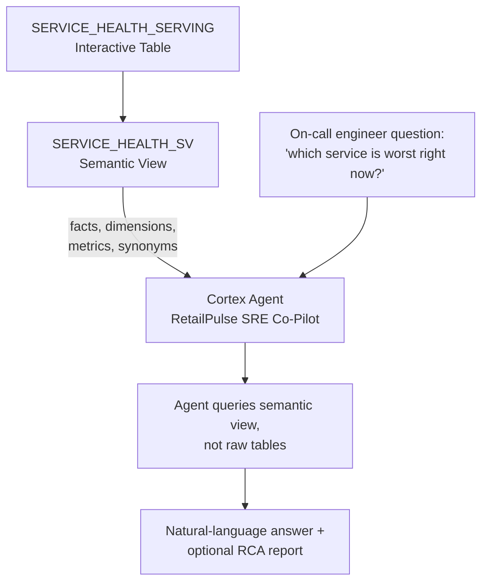

# Agent Grounding Flow

The agent never sees `SERVICE_HEALTH_SERVING`'s raw column names directly —
it reasons in terms of the facts, dimensions, and metrics the semantic view
exposes. This is what keeps answers grounded and keeps token spend down as
the number of underlying tables grows well past what fits in a demo account.
