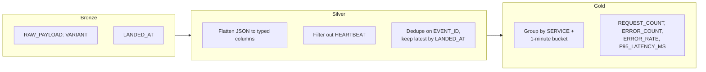

# Medallion Flow: Bronze → Silver → Gold

Each layer does one job. Bronze never transforms anything — it exists purely
to get data into Snowflake as fast and reliably as possible. Silver is where
correctness lives (types, dedup, noise filtering). Gold is where business
meaning lives (the metrics an SRE or an agent actually cares about).
