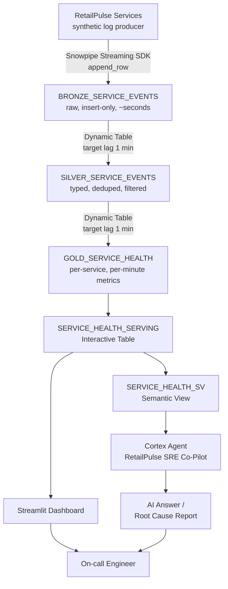

# System Architecture

Bronze is insert-only and typically queryable within seconds of being
streamed. Silver and Gold are Dynamic Tables — declarative SQL plus a
freshness target, not a scheduled job — refreshing within roughly a minute.
The Interactive Table exists purely to give the dashboard and the agent a
fast, high-concurrency read path that doesn't contend with the Dynamic Table
refresh itself.
